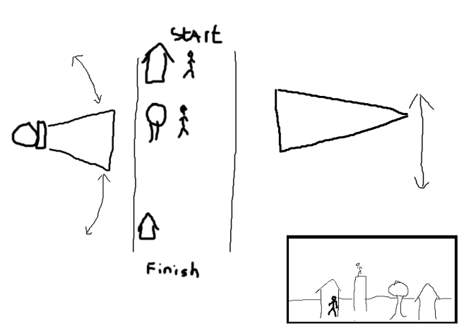
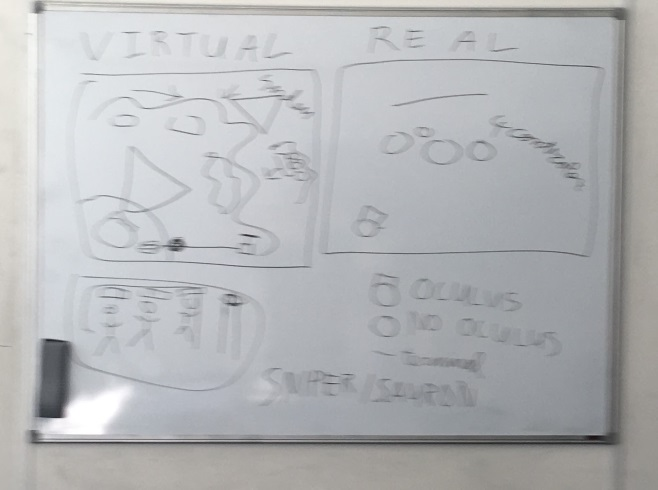
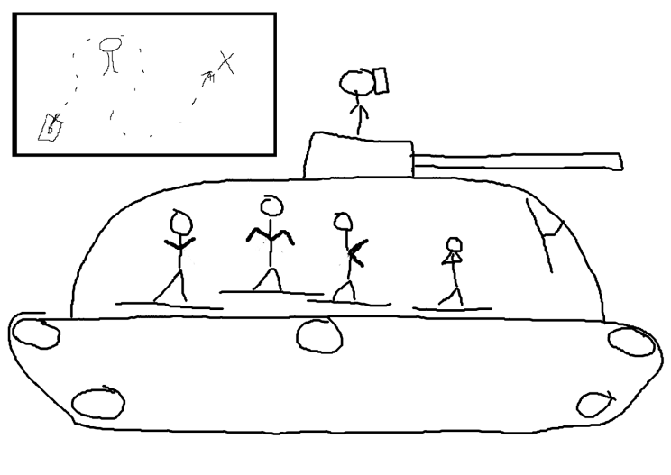
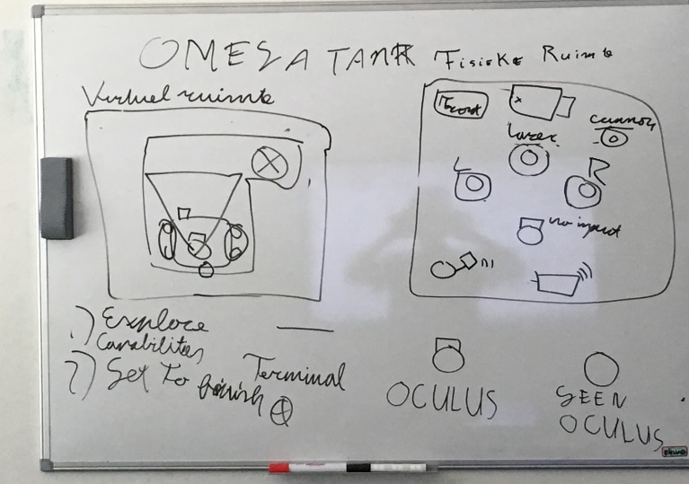
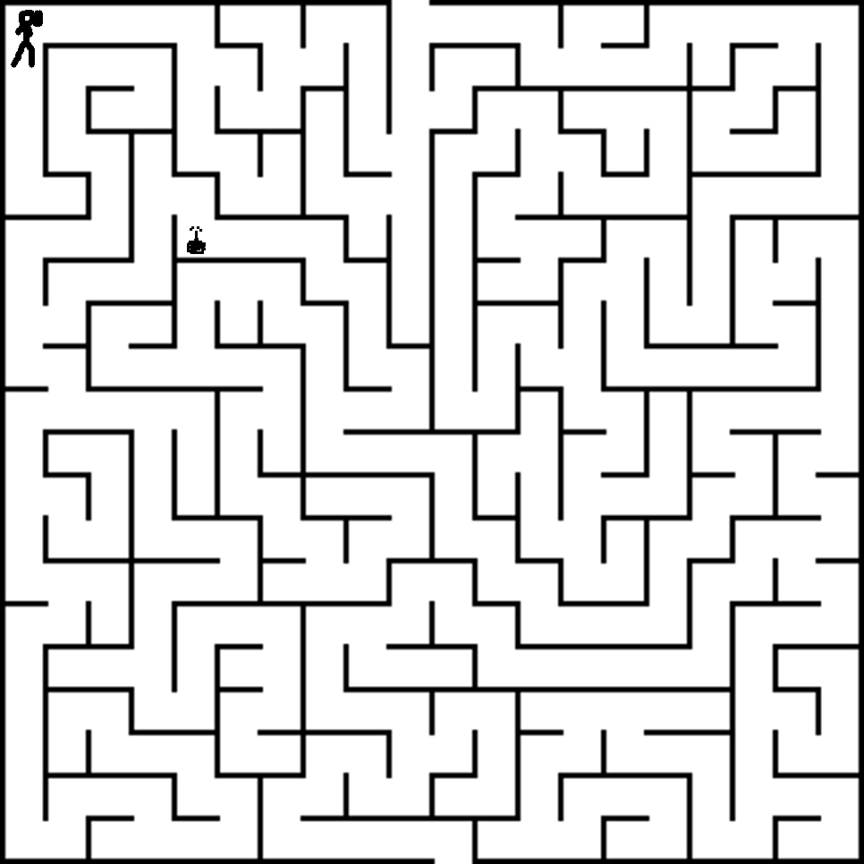

#Top 3 game concepts#

**1. Sniper**

The goal of the sniper game, as the name suggests, is to snipe other players down while they try to make their way through different courses. There are two different roles in this game. The player wearing the oculus rift is the sniper and the other players are characters that have to run the course. A more detailed explanation of the rolls:

Oculus rift user:

The oculus rift user sits in a high tower next to the course armed with a sniper or a laser beam, this gives him a full overview of the entire course, barring some blind spots (such as behind houses and other obstacles). This user needs to pay attention to the course and must manage to spot the other players and attempt to shoot them. If the player manages to kill all the other players before they reach the end of the course, he wins.

Other users:

The other users are all placed on a course next to the sniper tower, their aim is to get to the end of the course without getting shot by the sniper. To do this they have to make clever use of their surroundings (by hiding behind objects) or work together to get one person through (distracting the sniper and taking the bullet). As soon as one of these players make it through to the end of the course, they all win. The more players there are, the longer/more difficult the course will be.

**2. Omega Tank**

The omega tank is the ultimate VR tank experience. The omega tank is driven by an expert crew of people who execute strange, but effective dance moves on dance mats in order to control the tank. There is only one problem for this crew: they have no vision of the outside world! Here the vr guy comes to the rescue. The VR commander sits on top  of the omega tank and can guide the omega tank crew through the environment.

The environment is a level with an end goal. The tank should reach the end goal. There might be static enemies/obstacles which the tank should destroy. There can also be switched and levers that have to be turned on to control bridges or doors.

Each crew member controls a different part of the tank. One crew member will be responsible for the right tracks of the tank, another for the left tracks, together they can move the tank forward. Another crew member controls the turret and yet another can charge and shoot the laser. There might be more roles defined, but the roles should be able to be executed on at most 4 dance pads. Instead of dance pads, other complicated input methods may be considered.

The vr commander can see the environment in 3d, the crewmembers can only see the environment on  a map, which only shows the tank position and the finish point, however they cannot see any details of the environment. The vr commander should communicate the details to the crew members.

**3. Original maze game**

Original maze game is a game where one player is stuck in a maze and all the other players either have to help him get out, or prevent this from happening.

Oculus rift user:

The wearer of the oculus rift is dropped in a maze and has to find his way out to advance to the next level. To do this he gets the help of other players who can see an overview of the maze from their devices. The user can walk through the maze and might be able to do certain things like activating switches or using bombs to blow up a part of the walls. The oculus rift user is stuck in the maze from a first person view and thus only has limited vision as he can’t see through walls.

Device users:

The device users are divided into two teams: the first team has to help the oculus rift user get to the end of the maze. They do this by pointing the user in the right direction, telling them what road to take or when to use/find bombs and where the pitfalls are and how to avoid them. They might even be able to change small parts of the maze.

The other team has the goal to keep the oculus rift user from reaching the end of the maze. They can periodically make changes to the maze. This includes adding pitfalls, changing walls and even dropping bombs in the hope of catching the oculus rift player off guard and blowing them up.  

Both of these teams see the maze from the same top down view, so they will know the entire layout of the maze and they will both be able to see all pitfalls, bombs and walls in the maze.

